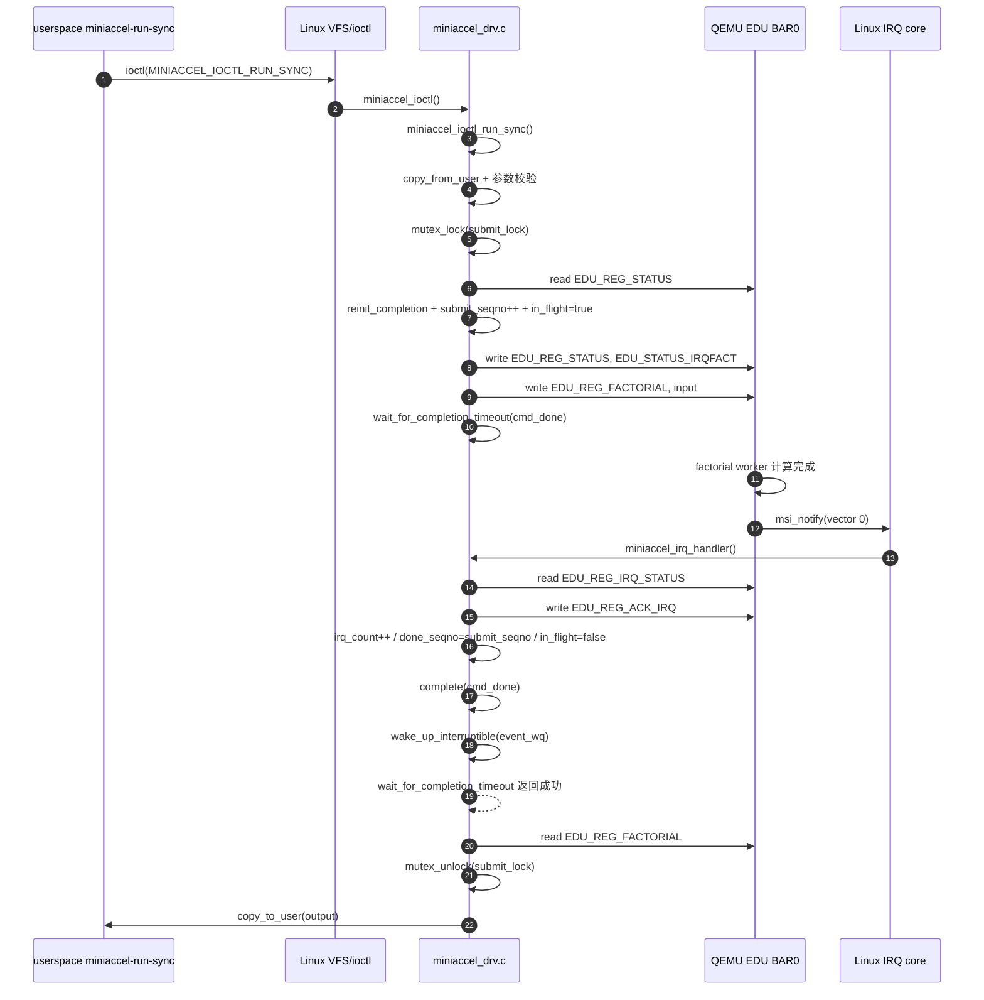

# 第 4 周 SOP：MSI 中断、completion 与 poll

本文记录 MiniAccel 第 4 周 Day 1-Day 6 的中断完成模型、MSI 注册、
ISR ACK、`RUN_SYNC` completion 等待、`poll()` 事件通知和错误路径测试。

最终验收目标：

1. `struct miniaccel_dev` 中具备 Week 04 中断完成模型需要的状态字段。
2. `completion`、`wait_queue`、`spinlock`、`submit_lock` 在 `probe()` 中初始化。
3. `probe()` 申请 MSI/MSI-X vector，并用 `request_irq()` 注册 ISR。
4. ISR 能读取 IRQ status、ACK 中断、推进完成状态，并唤醒 ioctl/poll。
5. `RUN_SYNC` 使用 `wait_for_completion_timeout()` 等待 ISR 完成。
6. `.poll` 能按 file 维度消费完成事件，不重复上报旧事件。
7. timeout、非法 ioctl、并发提交和卸载路径都有自动化测试。

## 1. 当前上下文

### 1.0 实际执行记录

执行日期：2026-07-02 至 2026-07-03。

宿主机/Guest/工具版本：

- 宿主机工作目录：`/home/mogu/Miniaccel/miniaccel-stack`
- Guest 设备：QEMU EDU PCI device `1234:11e8`
- QEMU：使用宿主机 `/usr/bin/qemu-system-x86_64`

本次是否完整跑通：

- 文档已补齐。
- 代码字段、IRQ 注册、ISR、completion、poll 和 Day 6 错误路径已检查。
- Guest 编译、基础 ioctl、poll 和 Day 6 自动化测试结果见第 4 节和第 7 节。

未执行或阻塞项：

- 本地 QEMU build 里的
  `miniaccel-qemu/build/qemu-bundle/tmp/qemu-install/bin/qemu-system-x86_64`
  是断开的 symlink，无法直接使用；本次用系统 QEMU 验证。
- DMA 路径不属于本周内容。

### 1.1 已完成内容

- Week 03 的 `/dev/miniaccel0`、`QUERY` 已作为基线存在。
- BAR0 访问已封装为 `miniaccel_read32()` / `miniaccel_write32()`。
- `RUN_SYNC` 已从 `read_poll_timeout()` 切到 MSI + completion。
- `.poll` 已接入 `event_wq`，用户态 `tools/miniaccel-wait.c` 可等待完成事件。
- `tests/ioctl/test_irq_wait.sh` 已覆盖正常 IRQ、poll、timeout、非法 ioctl、
  并发提交、open fd 阻止卸载和 clean dmesg。

### 1.2 阶段边界

- 本文不实现 DMA。
- 当前 ISR 没有下半部，没有 threaded IRQ、tasklet 或 workqueue。
- 当前 `force_timeout` 是测试开关，默认关闭，只用于稳定触发 timeout 清理分支。

## 2. 目标调用链

Day 1 的目标是设计调用链；Day 4 之后当前运行路径已经切到 MSI +
completion。Week 03 原 polling 路径已经不再是当前实现：

```text
miniaccel-run-sync
  -> open /dev/miniaccel0
  -> ioctl(MINIACCEL_IOCTL_RUN_SYNC)
  -> copy_from_user(struct miniaccel_run_sync)
  -> mutex_lock(submit_lock)
  -> iowrite32(input, EDU_REG_FACTORIAL)
  -> read_poll_timeout(ioread32, EDU_REG_STATUS.COMPUTING 清零)
  -> ioread32(EDU_REG_FACTORIAL)
  -> mutex_unlock(submit_lock)
  -> copy_to_user(struct miniaccel_run_sync)
```

Week 04 当前 `RUN_SYNC` 路径：

```text
miniaccel-run-sync
  -> open /dev/miniaccel0
  -> ioctl(MINIACCEL_IOCTL_RUN_SYNC)
  -> mutex_lock(submit_lock)
  -> spin_lock_irqsave(irq_lock)
  -> submit_seqno++ / in_flight = true / reinit_completion(cmd_done)
  -> spin_unlock_irqrestore(irq_lock)
  -> iowrite32(input, command register)
  -> iowrite32(enable, interrupt enable register)
  -> wait_for_completion_timeout(cmd_done)
  -> read result or clean timeout state
  -> mutex_unlock(submit_lock)
  -> copy_to_user(struct miniaccel_run_sync)
```

当前 ISR 路径：

```text
miniaccel_irq_handler
  -> miniaccel_read32(EDU_REG_IRQ_STATUS)
  -> status == 0: return IRQ_NONE
  -> miniaccel_write32(EDU_REG_ACK_IRQ, status)
  -> spin_lock_irqsave(irq_lock)
  -> irq_status = status
  -> irq_count++
  -> done_seqno = submit_seqno
  -> in_flight = false
  -> spin_unlock_irqrestore(irq_lock)
  -> complete(&cmd_done)
  -> wake_up_interruptible(&event_wq)
  -> return IRQ_HANDLED
```

当前 `poll()` 路径：

```text
miniaccel_poll
  -> poll_wait(file, &event_wq, wait)
  -> spin_lock_irqsave(irq_lock)
  -> done_seqno > file->seen_seqno ? readable : not readable
  -> spin_unlock_irqrestore(irq_lock)
  -> return POLLIN | POLLRDNORM when readable
```

## 3. 实现步骤

### 3.1 增加中断完成模型字段

`struct miniaccel_dev` 需要保存一次提交、一次完成和 `poll()` 可见事件的共享状态：

| 字段 | 作用 |
|---|---|
| `int irq` | 保存 `pci_irq_vector()` 返回的 Linux IRQ 号；未申请前为 `-1` |
| `struct completion cmd_done` | `RUN_SYNC` 等待 ISR 完成当前命令 |
| `wait_queue_head_t event_wq` | `poll()` 等待完成事件 |
| `spinlock_t irq_lock` | 保护 ISR 与进程上下文共享的完成状态 |
| `struct mutex submit_lock` | 串行化一次 `RUN_SYNC` 提交 |
| `u32 irq_status` | 保存最近一次 IRQ status |
| `u64 irq_count` | 统计已处理的 IRQ 数量 |
| `u64 submit_seqno` | 进程提交命令时递增 |
| `u64 done_seqno` | ISR 完成命令时更新 |
| `bool in_flight` | 表示当前设备是否有一个命令未完成 |

检查命令：

```bash
cd /home/mogu/Miniaccel/miniaccel-stack
rg -n "cmd_done|event_wq|irq_lock|irq_status|irq_count|submit_seqno|done_seqno|in_flight" \
  driver/char/miniaccel_drv.c
```

观察：

```text
driver/char/miniaccel_drv.c:75:	struct completion cmd_done;
driver/char/miniaccel_drv.c:76:	wait_queue_head_t event_wq;
driver/char/miniaccel_drv.c:78:	spinlock_t irq_lock;
driver/char/miniaccel_drv.c:80:	u32 irq_status;
driver/char/miniaccel_drv.c:81:	u64 irq_count;
driver/char/miniaccel_drv.c:82:	u64 submit_seqno;
driver/char/miniaccel_drv.c:83:	u64 done_seqno;
driver/char/miniaccel_drv.c:84:	bool in_flight;
```

验收：

- 需要的 Day 1 字段已加入。
- 当前代码已经使用这些字段完成 Day 4-Day 6 的 IRQ、completion 和 poll 路径。

### 3.2 初始化同步原语和初始状态

`probe()` 中初始化 Day 1 状态：

```c
mdev->irq = -1;
init_completion(&mdev->cmd_done);
init_waitqueue_head(&mdev->event_wq);
spin_lock_init(&mdev->irq_lock);
mutex_init(&mdev->submit_lock);
```

`kzalloc()` 已经把 `irq_status`、`irq_count`、`submit_seqno`、`done_seqno` 和
`in_flight` 初始化为 0/false。

检查命令：

```bash
cd /home/mogu/Miniaccel/miniaccel-stack
rg -n "irq = -1|init_completion|init_waitqueue_head|spin_lock_init|mutex_init" \
  driver/char/miniaccel_drv.c
```

观察：

```text
driver/char/miniaccel_drv.c:466:	mdev->irq = -1;
driver/char/miniaccel_drv.c:467:	init_completion(&mdev->cmd_done);
driver/char/miniaccel_drv.c:468:	init_waitqueue_head(&mdev->event_wq);
driver/char/miniaccel_drv.c:469:	spin_lock_init(&mdev->irq_lock);
driver/char/miniaccel_drv.c:470:	mutex_init(&mdev->submit_lock);
```

验收：

- `completion`、`wait_queue`、`spinlock`、`mutex` 已初始化。
- `irq = -1` 可以让后续 remove/error path 判断是否已申请 IRQ。

### 3.3 锁规则

锁规则：

- `submit_lock` 只在进程上下文使用，用来串行化一次提交。
- `irq_lock` 保护 ISR 与进程上下文共享的状态：
  `irq_status`、`irq_count`、`submit_seqno`、`done_seqno`、`in_flight`。
- 进程上下文需要同时访问提交状态时，先持有 `submit_lock`，再短时间持有
  `irq_lock`。
- ISR 只允许持有 `irq_lock`，禁止拿 `submit_lock`。
- ISR 中禁止睡眠，禁止 `copy_to_user()` / `copy_from_user()`，禁止调用 mutex。

后续代码约束：

```text
process context:
  mutex_lock(submit_lock)
  spin_lock_irqsave(irq_lock)
  update submit state
  spin_unlock_irqrestore(irq_lock)
  wait_for_completion_timeout()
  mutex_unlock(submit_lock)

interrupt context:
  read/ack IRQ register
  spin_lock_irqsave(irq_lock)
  update done state
  spin_unlock_irqrestore(irq_lock)
  complete()
  wake_up_interruptible()
```

验收：

- 锁顺序只有 `submit_lock -> irq_lock`。
- ISR 不会反向获取 `submit_lock`，避免死锁。

### 3.4 timeout 后 `in_flight` 清理规则

`RUN_SYNC` 切换到 completion 后，timeout 路径必须在进程上下文清理：

```text
wait_for_completion_timeout() == 0
  -> spin_lock_irqsave(irq_lock)
  -> if (in_flight)
       in_flight = false
  -> spin_unlock_irqrestore(irq_lock)
  -> return -ETIMEDOUT
```

当前代码中的 `force_timeout=1` 也走同一个 `clear_in_flight` 标签，用来稳定验证
timeout 后下一次提交不会被旧的 `in_flight` 卡住。

迟到 IRQ 的处理规则：

- ISR 仍然要读取 `IRQ_STATUS` 并 ACK，避免中断风暴。
- 如果发现 `in_flight == false`，说明命令可能已经 timeout 清理；ISR 只更新
  `irq_status` / `irq_count`，不应该把旧命令重新暴露成一次成功完成。
- `done_seqno` 只能在确认当前完成属于有效提交时推进。
- `poll()` 只根据 `done_seqno > seen_seqno` 报告可读，不能因为迟到 IRQ 无限重复上报。

验收：

- timeout 后下一次 `RUN_SYNC` 可以再次提交。
- 迟到 IRQ 不会让已经 timeout 的 ioctl 改成成功。
- IRQ 必须 ACK，避免设备持续拉高中断。

## 4. 自动化验证

验证命令：

```bash
cd /home/mogu/Miniaccel/miniaccel-stack
QEMU_SYSTEM_X86_64=/usr/bin/qemu-system-x86_64 ./scripts/run-qemu.sh
./scripts/verify-guest.sh
./scripts/ssh-guest.sh 'cd /mnt/miniaccel && make -C driver/char W=1'
./scripts/ssh-guest.sh 'cd /mnt/miniaccel && ./tests/ioctl/test_query.sh'
./scripts/ssh-guest.sh 'cd /mnt/miniaccel && ./tests/ioctl/test_run_sync.sh'
```

实际输出：

```text
Waiting for SSH and cloud-init...
Guest is ready. EDU device: 00:02.0 Unclassified device [00ff]: Device [1234:11e8] (rev 10)

make: Entering directory '/mnt/miniaccel/driver/char'
make -C /lib/modules/6.1.0-49-amd64/build M=/mnt/miniaccel/driver/char modules
  CC [M]  /mnt/miniaccel/driver/char/miniaccel_drv.o
  MODPOST /mnt/miniaccel/driver/char/Module.symvers
  CC [M]  /mnt/miniaccel/driver/char/miniaccel_drv.mod.o
  LD [M]  /mnt/miniaccel/driver/char/miniaccel_drv.ko
  BTF [M] /mnt/miniaccel/driver/char/miniaccel_drv.ko
Skipping BTF generation for /mnt/miniaccel/driver/char/miniaccel_drv.ko due to unavailability of vmlinux
make: Leaving directory '/mnt/miniaccel/driver/char'

device_id=0x11e8 version=0x010000ed capabilities=0x0000000000000001
query-ioctl-ok
input=0 output=1 timeout_ms=1000
input=5 output=120 timeout_ms=1000
input=12 output=479001600 timeout_ms=1000
run-sync-ioctl-ok
```

验收答案：

- 驱动是否能编译：可以，`miniaccel_drv.ko` 在 Guest 中完成编译和链接。
- `QUERY` 是否仍可用：可以，返回 `device_id=0x11e8`、`version=0x010000ed`、
  `capabilities=0x1`。
- `RUN_SYNC completion` 是否可用：可以，`0!`、`5!`、`12!` 均返回预期结果；
  MSI 计数递增的证据见第 5.5 节。
- 严重内核错误：`dmesg | grep -E "Oops|BUG|WARNING|Call Trace|panic"` 无输出。

## 5. 当前代码级触发链路（Day 4）

本节记录当前 `RUN_SYNC` 已切到 completion 后的真实触发链路。行号基于当前
`driver/char/miniaccel_drv.c` 和 `miniaccel-qemu/hw/misc/edu.c`。

### 5.1 Mermaid 时序图



### 5.2 KMD 提交路径逐行触发

| 顺序 | 代码位置 | 动作 | 结果 |
|---|---|---|---|
| 1 | `miniaccel_ioctl_run_sync()` `driver/char/miniaccel_drv.c:118` | 进入 `RUN_SYNC` 实现 | 后续都在进程上下文执行，可以睡眠 |
| 2 | `driver/char/miniaccel_drv.c:127` | `copy_from_user(&run, argp, sizeof(run))` | 从用户态拿到 `input` / `timeout_ms` |
| 3 | `driver/char/miniaccel_drv.c:130-137` | 校验 `reserved`、`timeout_ms`、`input` | 非法参数直接返回 `-EINVAL` |
| 4 | `driver/char/miniaccel_drv.c:139` | `timeout_jiffies = msecs_to_jiffies(run.timeout_ms)` | 把用户传入的毫秒 timeout 转成 kernel jiffies |
| 5 | `driver/char/miniaccel_drv.c:141` | `mutex_lock(&mdev->submit_lock)` | 串行化一次 `RUN_SYNC` 提交 |
| 6 | `driver/char/miniaccel_drv.c:143-150` | 读取 `EDU_REG_STATUS` 并检查 `EDU_STATUS_COMPUTING` | 如果设备还在算，返回 `-EBUSY` |
| 7 | `driver/char/miniaccel_drv.c:152-161` | 拿 `irq_lock`，检查并设置提交状态 | `reinit_completion()`，`submit_seqno++`，`in_flight=true` |
| 8 | `driver/char/miniaccel_drv.c:163-166` | `force_timeout=1` 时直接跳到 timeout 清理 | 稳定测试 `clear_in_flight` 分支 |
| 9 | `driver/char/miniaccel_drv.c:168` | 写 `EDU_REG_STATUS = EDU_STATUS_IRQFACT` | 告诉 EDU：factorial 完成后要触发 IRQ |
| 10 | `driver/char/miniaccel_drv.c:172` | 写 `EDU_REG_FACTORIAL = run.input` | 真正提交 factorial 命令给设备 |
| 11 | `driver/char/miniaccel_drv.c:176-179` | `wait_for_completion_timeout(&mdev->cmd_done, timeout_jiffies)` | 当前进程睡眠，等待 ISR 调用 `complete()` |
| 12 | `driver/char/miniaccel_drv.c:181-183` | completion 成功后读取 `EDU_REG_FACTORIAL` | 取回 QEMU EDU 写好的 factorial 结果 |
| 13 | `driver/char/miniaccel_drv.c:185-190` | 解锁并 `copy_to_user()` | 把 `run.output` 返回给用户态 |
| 14 | `driver/char/miniaccel_drv.c:192-200` | timeout 或提交后错误路径 | 清 `in_flight`，释放 `submit_lock`，返回错误码 |

关键点：`wait_for_completion_timeout()` 不是轮询。它会让当前进程睡眠；真正把它唤醒的是 IRQ handler 里的 `complete(&mdev->cmd_done)`。

### 5.3 QEMU EDU 侧触发 IRQ 的逐行链路

| 顺序 | 代码位置 | 动作 | 结果 |
|---|---|---|---|
| 1 | `miniaccel-qemu/hw/misc/edu.c:269-276` | Guest 写 BAR0 `0x20`，设置 `EDU_STATUS_IRQFACT` | QEMU EDU 记住“完成 factorial 后需要发 IRQ” |
| 2 | `miniaccel-qemu/hw/misc/edu.c:256-268` | Guest 写 BAR0 `0x08`，提交 factorial 输入 | QEMU EDU 设置 `EDU_STATUS_COMPUTING` 并唤醒 worker |
| 3 | `miniaccel-qemu/hw/misc/edu.c:351-354` | worker 计算完成并写回 `edu->fact` | 结果已经可从 BAR0 `0x08` 读回 |
| 4 | `miniaccel-qemu/hw/misc/edu.c:359-362` | 如果 `EDU_STATUS_IRQFACT` 已置位，调用 `edu_raise_irq(FACT_IRQ)` | 触发 factorial 完成中断 |
| 5 | `miniaccel-qemu/hw/misc/edu.c:85-94` | `edu_raise_irq()` 设置 `irq_status`，MSI enabled 时调用 `msi_notify(&edu->pdev, 0)` | QEMU 向 Guest 注入 MSI vector 0 |

这里的 `FACT_IRQ` 是 `0x1`，对应 KMD 里的 `EDU_IRQ_FACTORIAL`。

### 5.4 ISR 完成路径逐行触发

| 顺序 | 代码位置 | 动作 | 结果 |
|---|---|---|---|
| 1 | `driver/char/miniaccel_drv.c:325` | Linux IRQ core 调用 `miniaccel_irq_handler()` | 进入硬中断上下文 |
| 2 | `driver/char/miniaccel_drv.c:333-335` | 读 `EDU_REG_IRQ_STATUS` | `status == 0` 时返回 `IRQ_NONE` |
| 3 | `driver/char/miniaccel_drv.c:337-339` | 写 `EDU_REG_ACK_IRQ` | ACK 设备中断，避免中断状态一直挂着 |
| 4 | `driver/char/miniaccel_drv.c:341-349` | 拿 `irq_lock` 更新共享状态 | `irq_count++`，如果是 factorial IRQ 且有 in-flight，则推进 `done_seqno` 并清 `in_flight` |
| 5 | `driver/char/miniaccel_drv.c:351-354` | `complete(&mdev->cmd_done)` 和 `wake_up_interruptible()` | 唤醒睡在 `wait_for_completion_timeout()` 的 ioctl 进程，并通知后续 `poll()` 等待队列 |
| 6 | `driver/char/miniaccel_drv.c:356` | 返回 `IRQ_HANDLED` | 告诉 IRQ core：这个中断已处理 |

注意：`return IRQ_HANDLED` 不会自动进入下半部。当前实现没有 threaded IRQ、workqueue 或 tasklet；它只是结束 ISR。`RUN_SYNC` 继续执行，是因为 `complete()` 唤醒了睡眠中的进程上下文。

### 5.5 IRQ 注册路径

| 顺序 | 代码位置 | 动作 | 结果 |
|---|---|---|---|
| 1 | `driver/char/miniaccel_drv.c:466-470` | 初始化 IRQ/completion/waitqueue/lock | 为中断完成模型准备状态 |
| 2 | `driver/char/miniaccel_drv.c:472-477` | `pci_alloc_irq_vectors(pdev, 1, 1, PCI_IRQ_MSIX \| PCI_IRQ_MSI)` | 启用 1 个 MSI/MSI-X vector |
| 3 | `driver/char/miniaccel_drv.c:478-483` | `pci_irq_vector(pdev, 0)` | 把设备 vector 0 转成 Linux IRQ 号 |
| 4 | `driver/char/miniaccel_drv.c:484-488` | `request_irq(mdev->irq, miniaccel_irq_handler, 0, DRV_NAME, mdev)` | 把 Linux IRQ 绑定到 KMD 的 ISR |
| 5 | `driver/char/miniaccel_drv.c:530-533` | probe 失败路径释放 IRQ/vector | 避免 probe 中途失败泄漏 IRQ 资源 |
| 6 | `driver/char/miniaccel_drv.c:555-556` | remove 路径 `free_irq()` / `pci_free_irq_vectors()` | 卸载模块前断开 IRQ 和设备 vector |

当前实测证据：

```text
INTERRUPTS_BEFORE:
36: 0 0 PCI-MSI 32768-edge miniaccel_drv

运行 miniaccel-run-sync 0/5/12 后：

INTERRUPTS_AFTER:
36: 3 0 PCI-MSI 32768-edge miniaccel_drv
```

这说明每次 `RUN_SYNC` 已经实际触发一次 MSI，并由 `miniaccel_irq_handler()` 完成唤醒。

### 5.6 `complete()` 和 ioctl wait 的配合方式

`complete(&mdev->cmd_done)` 会唤醒睡在同一个 completion 对象上的
`wait_for_completion_timeout(&mdev->cmd_done, timeout_jiffies)`。
它们能配合起来，关键不是函数名相同，而是二者都操作同一个
`struct completion cmd_done`：

```text
ioctl 进程上下文:
  reinit_completion(&mdev->cmd_done)
  in_flight = true
  写 EDU_REG_STATUS 开启完成中断
  写 EDU_REG_FACTORIAL 提交命令
  wait_for_completion_timeout(&mdev->cmd_done, timeout)
    -> 当前进程睡眠

ISR 硬中断上下文:
  读 IRQ_STATUS
  写 ACK_IRQ
  done_seqno = submit_seqno
  in_flight = false
  complete(&mdev->cmd_done)
    -> 唤醒 ioctl 里睡眠的 wait
```

`completion` 只负责同步 ioctl 这条同步调用链。`poll()` 用的是另一条等待队列：
ISR 里同一处完成状态更新后，再调用 `wake_up_interruptible(&mdev->event_wq)`，
这样已经在 `poll_wait(file, &mdev->event_wq, wait)` 上登记过的用户进程也能醒来。

## 6. Day 5：poll 事件路径

Day 5 的目标是让用户态能用 `poll()` 等待设备完成事件，而不是只能通过同步
`RUN_SYNC` 得到结果。

代码实现点：

- `open()` 不再直接把 `struct miniaccel_dev *` 放进 `file->private_data`，
  而是分配 `struct miniaccel_file`。
- `miniaccel_file.mdev` 指向设备对象，所有打开的 fd 共享同一个设备状态。
- `miniaccel_file.seen_seqno` 是这个 fd 自己已经消费到的完成序号。
- `miniaccel_poll()` 先调用 `poll_wait(file, &mdev->event_wq, wait)` 注册等待队列，
  再用 `done_seqno > seen_seqno` 判断是否可读。
- ISR 完成当前命令后调用 `wake_up_interruptible(&mdev->event_wq)`，唤醒 poll 等待者。

关键代码位置：

| 代码位置 | 作用 |
|---|---|
| `driver/char/miniaccel_drv.c:88-91` | `struct miniaccel_file` 保存每个 fd 的 `mdev` 和 `seen_seqno` |
| `driver/char/miniaccel_drv.c:203-222` | `open()` 分配 `miniaccel_file`，并把 `seen_seqno` 初始化为当前 `done_seqno` |
| `driver/char/miniaccel_drv.c:225-230` | `release()` 释放 `file->private_data` |
| `driver/char/miniaccel_drv.c:254-275` | `miniaccel_poll()` 注册等待队列并按 `seqno` 返回 readable |
| `driver/char/miniaccel_drv.c:283` | `.poll = miniaccel_poll` 接入 VFS |
| `driver/char/miniaccel_drv.c:351-354` | ISR 完成命令后同时唤醒 ioctl completion 和 poll waitqueue |

用户态工具：

- `tools/miniaccel-wait.c` 打开 `/dev/miniaccel0`。
- 调用 `poll()` 等待 `POLLIN | POLLRDNORM`。
- 超时输出 `timeout timeout_ms=N`。
- 收到完成事件输出 `revents=0x41 readable`。

验收规则：

- 等待进程先打开 fd，再触发一次 `RUN_SYNC`，`poll()` 必须返回 readable。
- 新 fd 打开时把 `seen_seqno` 初始化为当前 `done_seqno`，所以不会消费历史旧事件。
- 同一个 fd 消费一次事件后，第二次 `poll()` 不能重复返回同一个旧完成。

## 7. Day 6：IRQ wait 错误路径和并发测试

Day 6 的目标是把中断等待路径从“手动看起来能跑”变成可重复验收。新增脚本：

```text
tests/ioctl/test_irq_wait.sh
```

脚本覆盖：

- 正常 `RUN_SYNC`：验证结果正确，并检查 `/proc/interrupts` 里 `miniaccel_drv`
  中断计数递增。
- `poll()` 唤醒：后台运行 `miniaccel-wait`，前台触发 `RUN_SYNC`，等待者收到 readable。
- 旧事件不重复：新 fd 再次 poll 100ms，应返回 timeout。
- 强制 timeout：`insmod miniaccel_drv.ko force_timeout=1`，`RUN_SYNC` 返回
  `-ETIMEDOUT`。
- timeout 清理：运行时写
  `/sys/module/miniaccel_drv/parameters/force_timeout` 为 0，同一模块实例下一次
  `RUN_SYNC` 成功，证明 `in_flight` 已清理。
- 非法 ioctl 参数。
- 8 线程 x 50 次并发 `RUN_SYNC`。
- 20 个进程并发 `RUN_SYNC`。
- open fd 时 `rmmod` 应失败，避免模块被打开文件引用时卸载。
- 最近 dmesg 不应出现 `Oops`、`BUG`、`WARNING`、`Call Trace`、`panic`。

### 7.1 Day 6 代码点

`force_timeout` 是测试开关，默认关闭：

```text
driver/char/miniaccel_drv.c:53:static bool force_timeout;
driver/char/miniaccel_drv.c:55:module_param(force_timeout, bool, 0644);
driver/char/miniaccel_drv.c:56:MODULE_PARM_DESC(force_timeout, "Force RUN_SYNC timeout for IRQ wait tests");
```

`RUN_SYNC` 设置 `in_flight=true` 后，如果 `force_timeout=1`，直接走
`clear_in_flight`：

```text
driver/char/miniaccel_drv.c:163:	if (force_timeout) {
driver/char/miniaccel_drv.c:164:		ret = -ETIMEDOUT;
driver/char/miniaccel_drv.c:165:		goto clear_in_flight;
driver/char/miniaccel_drv.c:192:clear_in_flight:
driver/char/miniaccel_drv.c:193:	spin_lock_irqsave(&mdev->irq_lock, flags);
driver/char/miniaccel_drv.c:194:	if (mdev->in_flight)
driver/char/miniaccel_drv.c:195:		mdev->in_flight = false;
```

这个测试不依赖真实设备“刚好超过 1ms”，所以是稳定的。

### 7.2 实际执行记录

宿主机轻量检查：

```bash
cd /home/mogu/Miniaccel/miniaccel-stack
bash -n tests/ioctl/test_irq_wait.sh
gcc -Wall -Wextra -Werror -Iinclude/uapi tools/miniaccel-run-sync.c \
  -o /tmp/miniaccel-run-sync-host-check
gcc -Wall -Wextra -Werror -Iinclude/uapi tools/miniaccel-wait.c \
  -o /tmp/miniaccel-wait-host-check
./scripts/check-driver-style.sh
```

结果：

```text
bash -n: passed
miniaccel-run-sync.c: passed
miniaccel-wait.c: passed

check-driver-style.sh:
total: 0 errors, 2 warnings, 0 checks, 632 lines checked
```

两个 warning 是当前仓库已有的 `kzalloc(sizeof(...))` 风格提示：

```text
driver/char/miniaccel_drv.c:211:	mfile = kzalloc(sizeof(*mfile), GFP_KERNEL);
driver/char/miniaccel_drv.c:373:	mdev = kzalloc(sizeof(*mdev), GFP_KERNEL);
```

Guest 验证命令：

```bash
cd /home/mogu/Miniaccel/miniaccel-stack
QEMU_SYSTEM_X86_64=/usr/bin/qemu-system-x86_64 ./scripts/run-qemu.sh
./scripts/verify-guest.sh
./scripts/ssh-guest.sh 'cd /mnt/miniaccel && make -C driver/char W=1'
./scripts/ssh-guest.sh 'cd /mnt/miniaccel && ./tests/ioctl/test_irq_wait.sh'
```

Guest 编译结果：

```text
make: Entering directory '/mnt/miniaccel/driver/char'
make -C /lib/modules/6.1.0-49-amd64/build M=/mnt/miniaccel/driver/char modules
  CC [M]  /mnt/miniaccel/driver/char/miniaccel_drv.o
  MODPOST /mnt/miniaccel/driver/char/Module.symvers
  CC [M]  /mnt/miniaccel/driver/char/miniaccel_drv.mod.o
  LD [M]  /mnt/miniaccel/driver/char/miniaccel_drv.ko
  BTF [M] /mnt/miniaccel/driver/char/miniaccel_drv.ko
Skipping BTF generation for /mnt/miniaccel/driver/char/miniaccel_drv.ko due to unavailability of vmlinux
make: Leaving directory '/mnt/miniaccel/driver/char'
```

Day 6 脚本输出：

```text
input=5 output=120 timeout_ms=1000
normal-irq-ok before=0 after=1
input=6 output=720 timeout_ms=1000
revents=0x41 readable
poll-wakeup-ok
timeout timeout_ms=100
poll-no-stale-event-ok
ioctl RUN_SYNC failed: Connection timed out
forced-timeout-ok
input=5 output=120 timeout_ms=1000
timeout-cleanup-ok
invalid-ioctl-enotty-ok
query-null-efault-ok
run-sync-null-efault-ok
run-sync-reserved-einval-ok
run-sync-timeout-zero-einval-ok
run-sync-timeout-too-large-einval-ok
run-sync-input-too-large-einval-ok
invalid-args-ok
invalid-ioctl-ok
concurrent-run-sync-ok threads=8 loops=50 total=400
multi-process-run-sync-ok count=20
open-fd-rmmod-blocked-ok
dmesg-clean-ok
unload-ok
irq-wait-sh-ok
```

验收答案：

- 正常中断：通过，`/proc/interrupts` 计数从 0 增加到 1。
- `complete()` 唤醒 ioctl wait：通过，`RUN_SYNC` 返回正确结果。
- `wake_up_interruptible()` 唤醒 poll：通过，`miniaccel-wait` 返回
  `revents=0x41 readable`。
- 旧事件不重复上报：通过，新 fd `poll()` 100ms 返回 timeout。
- timeout 后 `in_flight` 清理：通过，强制 timeout 后把参数改回 0，同一模块实例下
  `RUN_SYNC(5)` 再次成功。
- 并发路径：通过，8 线程 400 次和 20 进程并发都成功。
- 卸载路径：通过，open fd 时 `rmmod` 被阻止；脚本最终可正常卸载模块。
- 严重内核错误：通过，最近 dmesg clean。

## 8. 踩坑与修正

| 问题 | 现象 | 原因 | 修正 |
|---|---|---|---|
| 本地 QEMU bundle symlink 失效 | 运行打包路径时报 `No such file or directory` | `qemu-bundle/tmp/qemu-install/bin/qemu-system-x86_64` 指向不存在的 `build/qemu-system-x86_64` | 本次验证改用 `/usr/bin/qemu-system-x86_64` |
| Day 1 容易误改运行路径 | `RUN_SYNC` 可能提前变成半成品 completion | Day 1 只应建模，不应注册 IRQ 或等待 completion | 先用 Week 03 smoke test 保住基线，再在 Day 4 切到 completion |
| 极短 timeout 不稳定 | 用真实 `timeout_ms=1` 可能偶尔成功、偶尔超时 | 真实硬件/虚拟设备完成速度和调度时序不可控 | 增加默认关闭的 `force_timeout` 模块参数，稳定测试 timeout 清理分支 |

## 9. 本周产物

- `driver/char/miniaccel_drv.c`
- `tools/miniaccel-wait.c`
- `tests/ioctl/test_irq_wait.sh`
- `docs/week-04-interrupt-and-completion.md`

## 10. 下一步

下一步可以进入 Week 04 Day 7：整理一份周总结，按“设计模型 -> IRQ 注册 ->
ISR ACK -> completion wait -> poll -> 错误路径测试”的顺序，把本周的 API、
锁规则、触发链路和验收输出收成一份最终复盘。
